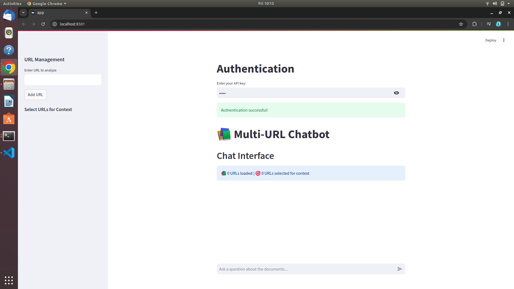
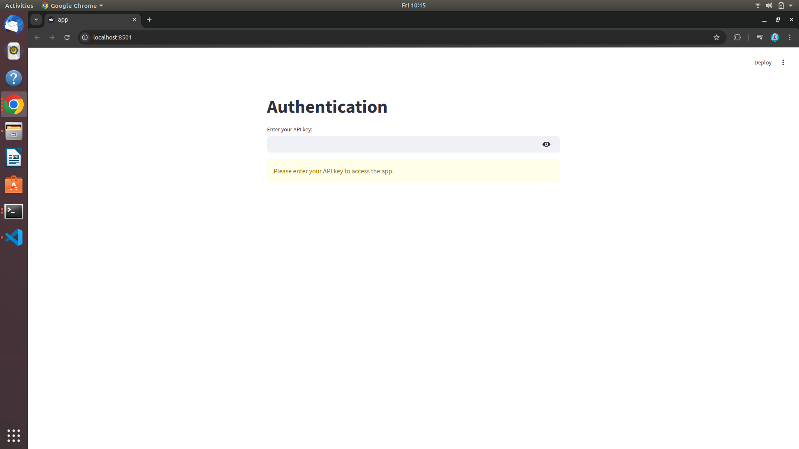
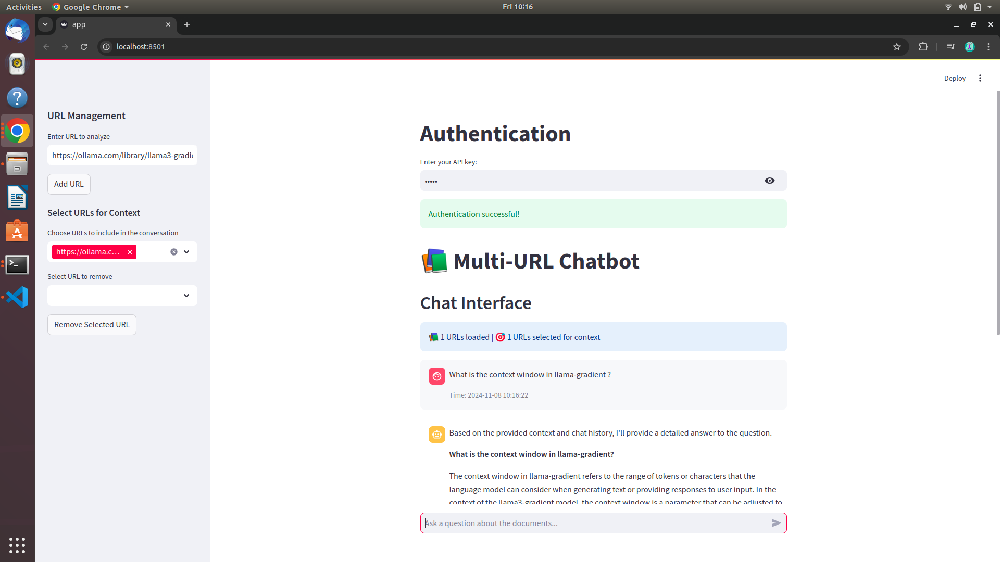
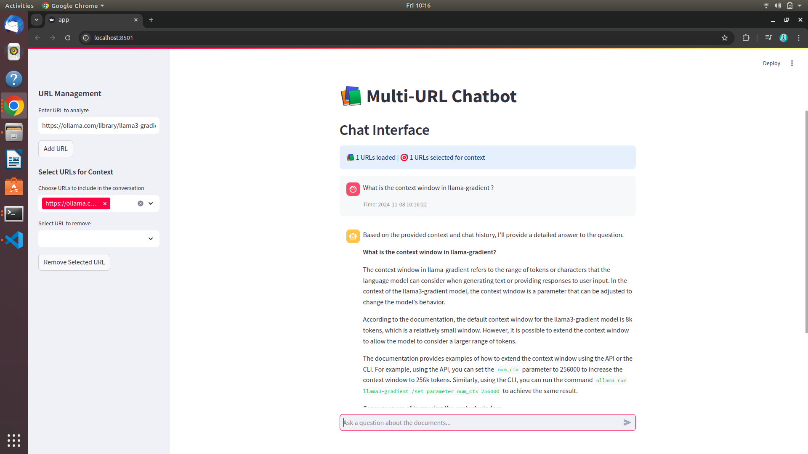

# URLinsights: A RAG-based URL Content Analysis System

## Executive Summary
URLinsights is a Retrieval Augmented Generation (RAG) system that enables intelligent question-answering based on URL content. The system combines modern NLP techniques, vector databases, and large language models to provide accurate, context-aware responses while maintaining source traceability.

## Table of Contents
- [Approach](#approach)
- [Technology Stack](#technology-stack)
- [Challenges & Solutions](#challenges--solutions)
- [Potential Improvements](#potential-improvements)
- [Installation](#installation)
- [Usage](#usage)
- [Conclusion](#conclusion)
- [UI Screens](#UI Screens)

## Approach
1. **Environment Setup**
   - Created dedicated Python environment for URLinsights
   - Configured necessary dependencies and libraries

2. **Core Functionality Implementation**
   - Utilized UnstructuredURLLoader (LangChain Community) for URL content extraction
   - Implemented text chunking (size: 1024, overlap: 100) for optimal embedding creation
   - Integrated sentence-transformers all-mpnet-base-v2 model for embeddings
   - Implemented FAISS for vector storage
   - Integrated Ollama and Groq for answer retrieval

3. **User Interface Development**
   - Built Streamlit-based frontend with features including:
     - User authentication
     - URL management (add/remove/select)
     - Multi-URL information retrieval
     - Chat history management
     
4. **Deployment**
   - Deployed on AWS EC2
   - Extended EBS storage for dependencies
   - Implemented RAG system features (source tracking, context management)

## Technology Stack

| Category        | Technologies                |
|----------------|----------------------------|
| Backend        | Python                     |
| NLP Framework  | Langchain, Ollama, Groq   |
| LLM Models     | llama3                    |
| Vector Store   | FAISS                     |
| Frontend       | Streamlit                 |
| Cloud          | AWS EC2, AWS EBS          |

## Challenges & Solutions

1. **Environment Setup**
   - Challenge: Limited internet speed
   - Solution: Optimized dependency management and installation process

2. **Embedding Generation**
   - Challenge: Slow performance with OllamaEmbeddings
   - Solution: Migrated to HuggingfaceEmbeddings for improved speed

3. **Text Generation**
   - Challenge: High latency with Ollama (≈2 minutes)
   - Solution: Integrated Groq for near-instant responses

4. **Deployment**
   - Challenges:
     - Limited AWS free tier resources
     - Storage constraints
     - CPU limitations for embeddings
   - Solutions:
     - Optimized resource usage
     - Implemented efficient storage management
     
5. **Context Management**
   - Challenge: Token limits in extended conversations
   - Solution: Implemented context windowing and management

## Potential Improvements

1. **Scalability & Performance**
   - Integrate AWS Bedrock for improved scalability
   - Implement OpenSearch for parallel search capabilities
   - Optimize chunking parameters and strategy

2. **Model Enhancements**
   - Explore advanced embedding models
   - Evaluate alternative Language Models
   - Integrate Vision Language Models for image analysis

3. **Architecture**
   - Implement better chunking strategies
   - Optimize parameter configurations
   - Add support for multimedia content analysis

## Installation
```bash
# Clone the repository
git clone https://github.com/Harshit-tech9/ragURL.git

# Navigate to project directory
cd URLinsights

# Install dependencies
pip install -r requirements.txt

# Set up environment variables
cp .env.example .env
# Edit .env with your configurations
```

## Usage
```bash
# Start the Streamlit application
streamlit run app.py

# Access the application
# Open browser and navigate to: http://localhost:8501
```

## Conclusion
URLinsights demonstrates the potential of RAG systems for URL content analysis. The current implementation provides robust functionality for content extraction and analysis, while the proposed improvements outline a path for enhanced capabilities, performance, and scalability. 

## UI Screens 

<!-- Features Screenshot Grid -->
<p float="left">
  

   
  
  
  
  
</p>
